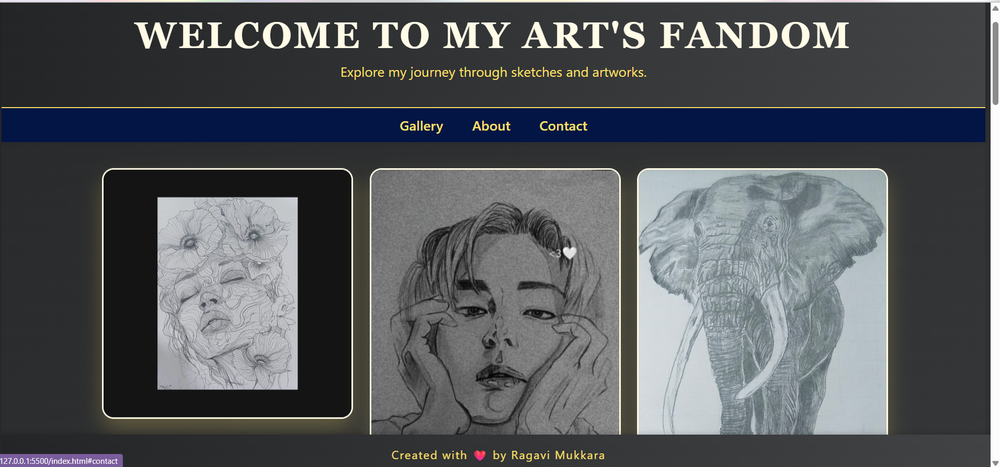

# 🎨 Arts Website by Ragavi Mukkara

Welcome to my personal **Arts Website**, a digital gallery showcasing my artistic journey!  
Explore my original artworks, creative sketches, all curated into a vibrant, visually engaging portfolio.

🌐 **Live Website:**  
🔗https://ragavi-mukkara.github.io/Arts-Website/

---

## 🖌️ What You’ll Find

- A beautifully designed **portfolio** of my artworks  
- Smooth user experience with an aesthetic layout  
- Fully responsive design – looks great on all devices  
- Dark theme for a modern, artistic feel

---

## 🗂️ Project Structure

Arts-Website/
├── index.html # Home page
├── about.html # About the artist
├── gallery.html # Artwork gallery
├── contact.html # Contact page
├── artworks/ # Folder containing all artwork images
├── css/
│ └── style.css # Custom CSS styles
└── README.md # Project documentation


---

## 🛠️ Technologies Used

- HTML5  
- CSS3 (custom styling and layout)  
- Basic responsive design techniques  
- GitHub Pages for deployment

---

## 🚀 How to Use

To run the website locally:

```bash
git clone https://github.com/Ragavi-Mukkara/Arts-Website.git
cd Arts-Website
open index.html  # or open in your browser

Preview


🙋‍♀️ About Me
I’m Ragavi Mukkara — an artist, designer, and creative enthusiast. This website is my visual diary showcasing some of my beautiful artworks.

📬 Contact
Want to share your thoughts or collaborate? Reach out through the Contact page on the website!

📌 License
This project is open for personal use and inspiration. Please give credit if you’re using or referencing it.

Made with ❤️ by Ragavi Mukkara


