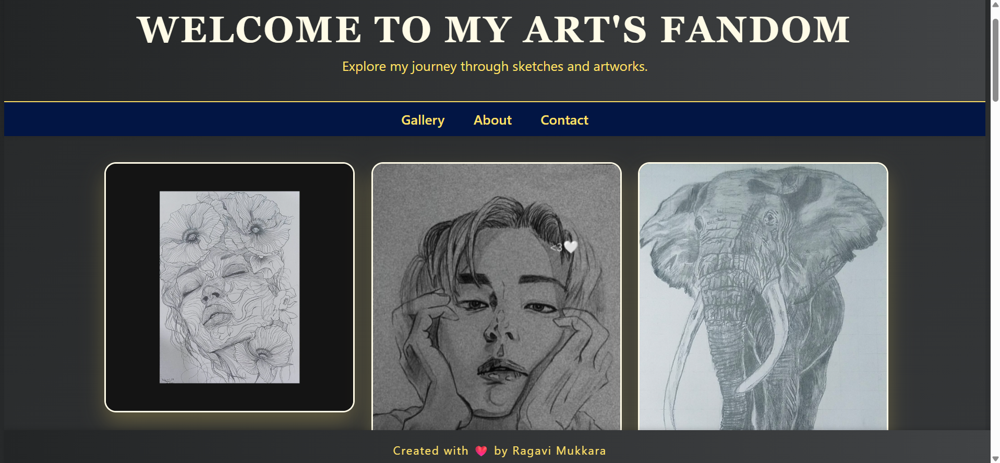

# 🎨 Arts Website by Ragavi Mukkara

Welcome to my personal **Arts Website**, a digital gallery showcasing my artistic journey!  
Explore my original artworks, creative sketches, all curated into a vibrant, visually engaging portfolio.

🌐 **Live Website:**  
🔗https://ragavi-mukkara.github.io/Arts-Website/

---

## 🖌️ What You’ll Find

- A beautifully designed **portfolio** of my artworks  
- Smooth user experience with an aesthetic layout  
- Fully responsive design – looks great on all devices  
- Dark theme for a modern, artistic feel

---

## 🗂️ Project Structure

Arts-Website/
index.html # Home page
about.html # About the artist
gallery.html # Artwork gallery
contact.html # Contact page
artworks/ # Folder containing all artwork images
css/
│ └── style.css # Custom CSS styles
README.md # Project documentation

---

## 🛠️ Technologies Used

- HTML5  
- CSS3 (custom styling and layout)  
- Basic responsive design techniques  
- GitHub Pages for deployment

---

## 📸 Website Preview

🙋‍♀️ About Me
I’m Ragavi Mukkara — an artist, designer, and creative enthusiast. This website is my visual diary showcasing some of my beautiful artworks.

📬 Contact
Want to share your thoughts or collaborate? Reach out through the Contact page on the website!

📌 License
This project is open for personal use and inspiration. Please give credit if you’re using or referencing it.

Made with ❤️ by Ragavi Mukkara

